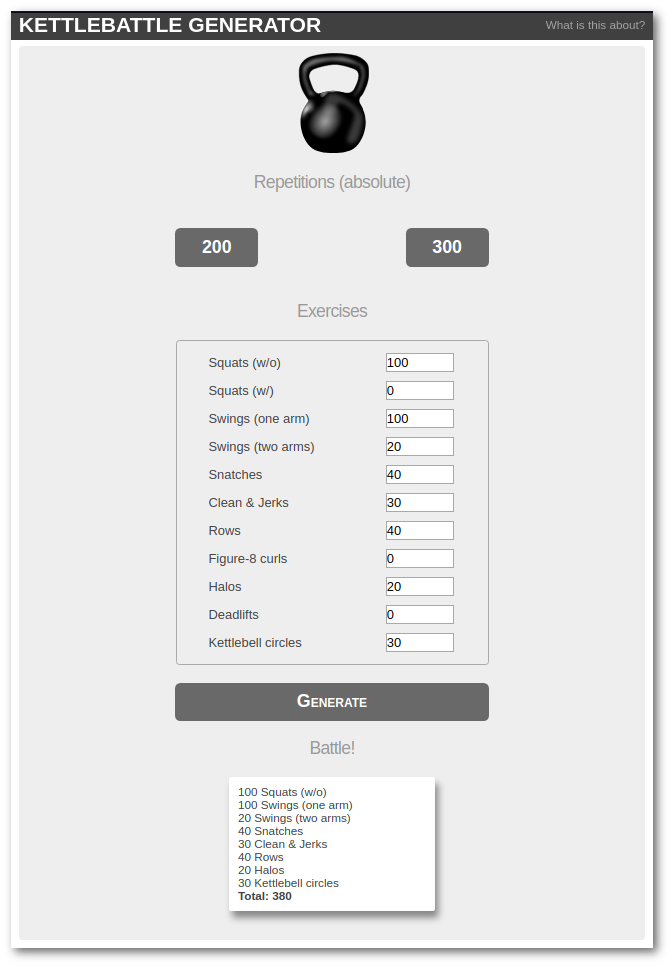

##### (German version)

## KETTLE...WAS?

Genau. Okay, du weißt nicht, was Kettlebattle ist, kein Problem. Die Menschen, die diesem Unsinn nachgehen, dürften sich zahlenmäßig aktuell im einstelligen Bereich bewegen (Stand: Januar 2018).

**Kettlebattle ist ein kollaboratives Kettlebell-Home-Workout ab zwei Mitspielern.**

Die Frontlinie der "Battle" befindet sich dabei nicht zwischen den Mitspielern, sondern zwischen Motivation, Schweinehund, Sofa und Hanteln. Team up!

## SPIELREGELN

1. Die Kontaktaufnahme  
Der potentielle Mitspieler wird mit *"Kettlebattle?"* kontaktiert.
1. Der Workout-Vorschlag  
Hat der Mitspieler die Kontaktaufnahme positiv beantwortet, schlägt der Initiator ein Workout vor, das der Mitspieler akzeptieren muss. Fairness geht vor. Wer nach einem langen Tag mitten in der Nacht seinem Mitspieler ein hartes Workout vorschlägt, hat schnell keine Mitspieler mehr.
1. Do you even lift?  
Do it.
1. Das Finisher-Selfie  
Der krönende Abschluss jeder Kettlebattle ist das Finisher-Foto, das man dem Mitspieler nach dem Workout als Beweis seiner Sportlichkeit zuschickt. Hierbei ist absolute Ernsthaftigkeit zu wahren, es geht hier schließlich um Kettlebattle!

## DER GENERATOR

Der Kettlebattle-Generator ist eine Einseiten-Web-App, mit der sich aus einem zuvor definierten Übungspool ein Workout generieren lässt.

### Habenwill!

* für die Ausführung wird [Flask](http://flask.pocoo.org) benötigt
* `./kbgen.py` ausführen, dies startet den internen Flask-Server¹
* [127.0.0.1:5000](http://127.0.0.1:5000/) aufrufen
* Workout generieren
* Werte können per Spinner geändert werden

### Konfiguration

In der `./kbgen.py` gibt es 3 Variablen für individuelle Einstellungen:

1. **`REPS_PRESET`**: Tupel mit 2 Werten (int) für die Preset-Buttons, Gesamtwiederholungen 
1. **`KB_EX`**: Liste von Übungen, die bei der Kettlebattle zur Auswahl stehen sollen, ein Listeneintrag ist ein Tupel nach dem Muster (Name, Minimum bei Preset 1, Minimum bei Preset 2)
1. **`MAX_EX`**: Maximale Anzahl (int) von Übungen, die aus der Liste durchgeführt werden sollen, Minimumwerte werden immer gezählt

## VERWEISE

* Kettlebell-Image: [openclipart.org](https://openclipart.org/detail/241218/kettlebell)
* Layout: [An Introduction to Python’s Flask Framework](https://code.tutsplus.com/tutorials/an-introduction-to-pythons-flask-framework--net-28822)
* Kettlebattle ist eine Erfindung von [ZeEvilKohl](https://twitter.com/ZeEvilKohl) und [encarsia_](https://twitter.com/encarsia_) (yours truly)

## IRGENDWELCHE PLÄNE FÜR SPÄTER?

* Export in Textbildchen (leben wir nicht in tollen Zeiten?)
* Favoritenliste/Liste der letzten Kettlebattles
* Lokalisation

## SCREENSHOT!

##### (English version)
## KETTLE...WHAT?

to soon
_____

¹ wie man Flask-Apps produktiv betreibt, erfährt man u.a. in der [Dokumentation](http://flask.pocoo.org/docs/0.12/deploying/)

